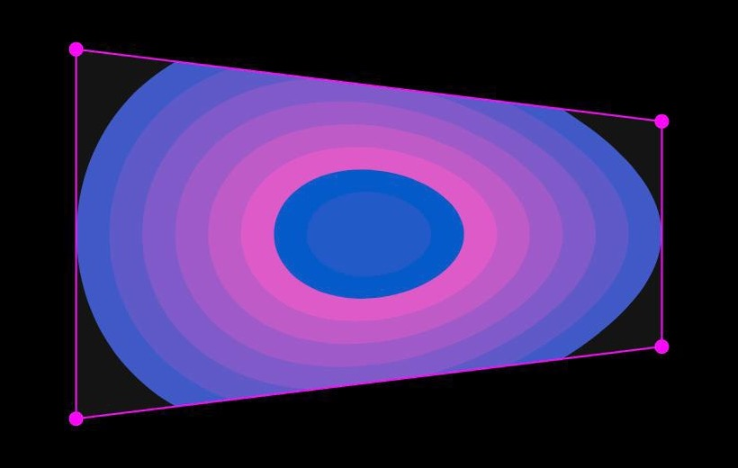

# PATCH 003: Projection Mapping Lab

The starter template for PATCH 003, a PhilaCon Valley lab at Pennovation Works on
Wednesday, September 30, 2026. You build a p5.js sketch on your laptop. Then you map it onto a
real object with a projector.



**Status:** in progress. Waskar and Jay are building the template before the lab.

## Run it on your machine

No build step. p5.js is in `lib/`, so it works with no Wi-Fi.

**No git? Download it.** On this page, click the green **Code** button, then **Download ZIP**.
Unzip the folder and open `index.html` in Chrome. That folder is yours to keep.

**With git:**

```bash
git clone https://github.com/philaconvalley/patch-003-projection-mapping.git
cd patch-003-projection-mapping
open index.html
```

| Key or mouse | Action |
|---|---|
| Drag a pink corner | Move that corner onto the corner of your surface |
| Drag inside the shape | Move the whole shape without changing it |
| E | Hide or show the corners. Hide them before you project |
| F | Full screen |

## Run it in your browser, with nothing to install

A version in the [p5.js Web Editor](https://editor.p5js.org) is coming before the lab. The link
goes here. You can edit and run it without an account. To save your work, make a free p5.js account
first.

## Put it on a projector

1. **Connect the projector** to your laptop. Most laptops need a USB-C to HDMI adapter.
2. **Extend your display, do not mirror it.** On a Mac: System Settings, then Displays. If the two
   screens show the same thing, turn mirroring off.
3. **Open `index.html` in Chrome.**
4. **Drag the Chrome window onto the projector's screen.** It sits off one edge of your laptop
   screen.
5. **Click the page, then press F** for full screen.
6. **Drag the four pink corners onto the corners of your object.** Watch the wall, not your laptop.
7. **Press E** to hide the corners. Your art now sits only on the object.

Set the corners after you go full screen. If you leave full screen, set them again.

**Tip:** the room has to be dark. Anything that is not black on your screen shows up as light on
the wall.


Open `art.js`. It is the only file you need to change. `drawArt(g)` draws one frame of your art.
Draw into `g` the way you draw into a normal p5.js canvas: `g.circle(...)`, not `circle(...)`.

Want a head start? The `examples/` folder has four art files:

| File | What it does |
|---|---|
| `examples/stripes.js` | Stripes slide across the surface. Good for showing edges |
| `examples/noise.js` | A slow, living color field |
| `examples/text.js` | A word that pulses. Change it to your own word |
| `examples/particles.js` | Drifting dots with trails. Shows how to use `setupArt()` |

To use one, copy its code into `art.js`. Or open `index.html` and change `art.js` to the example's
path.

`setupArt(g)` is optional. It runs once at the start. Use it for anything you create only one time.

## What the template does

1. **Corners.** Drag the four pink corners onto the corners of your object.
2. **Warp.** Your art stretches to fit those four corners.
3. **Move.** Drag inside the shape to move it without changing it.
4. **Preview.** You see the result on your laptop before you get projector time.

**Coming next:** more than one surface, so you can map each panel of a board or each face of a
box. After that, saving your corner positions so a reload does not reset them.

**Known limit:** the corners do not follow the window. If you resize the window or leave full
screen, set the corners again.

## Files

- `index.html`: the page. It loads the styles and the scripts, and holds no code of its own.
- `style.css`: the page styles. A black, full-window canvas with no scroll bars.
- `art.js`: your art. Start here.
- `examples/`: four art files to copy from.
- `sketch.js`: the mapping engine. You do not need to change it. `GRID` splits the surface into
  small cells so the image does not bend along the diagonal.
- `lib/p5.min.js`: p5.js 1.11.13, saved in the repo for offline use.

## License

The code uses the MIT license. See `LICENSE`. p5.js uses the LGPL 2.1 license.

## PhilaCon Valley

A Philadelphia tech community, by us, for us. Come build with us:
[Discord](https://discord.gg/fxUfeSbFZM).
